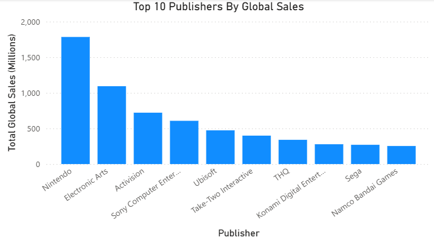
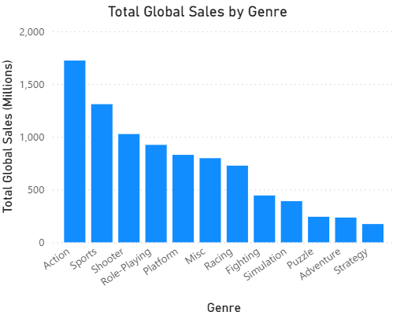
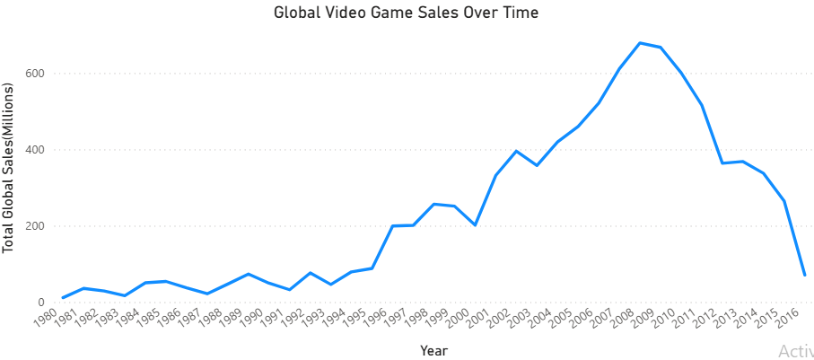

# Video Game Sales Dashboard (Power BI)

## Overview
Built a Power BI dashboard analyzing video game sales.

## Tools Used
- Power BI
- CSV dataset
- Data cleaning and transformation (Power Query)

## Key Insights

- In the eight-generation console era the WiiU severely underperformed when compared to it's Xbox One and PS4 counterparts in most areas.
- The Xbox One sales were limited greatly by it's inability to sell in the Japanese market.
- PlayStation with the PS4 came out as king of the era due to it's overwhelming sales in Europe and beating out Xbox in Japan. 

---

- The top 3 companies Nintendo, EA, and Activision dominate publisher sales as a result of recurring games every year
- Nintendo provides titles like Mario, Zelda and Pokemon, EA titles like Madden and EA Sports FC, while Activision publishes Call of Duty
   
---

- The Action genre dominates the market with a much higher global sales total than other genres showing a love for fast-paced real time gameplay
- Action, Sports and Shooter genres make up the top 3 which align with the top publishers as many of the recurring games fall in these genres boosting totals
---

- Video Game Sales rose throughout the late 90's and early 2000's reaching a peak in 2008 with the PS2 and 3, Xbox 360, Wii, DS, and PSP all selling well that year.
- As the late 2010's arrived the game market fell due to factors like the Wii boom slowing, fewer blockbuster games and new business models like microtransactions and subscriptions.
- It is also worth noting that older datasets and the companies themselves at the time generally didn't count digital sales which accounts for a large chunk of sales in the modern era. 
## Data Source

Dataset: Kaggle Video Game Sales
https://www.kaggle.com/datasets/anandshaw2001/video-game-sales
